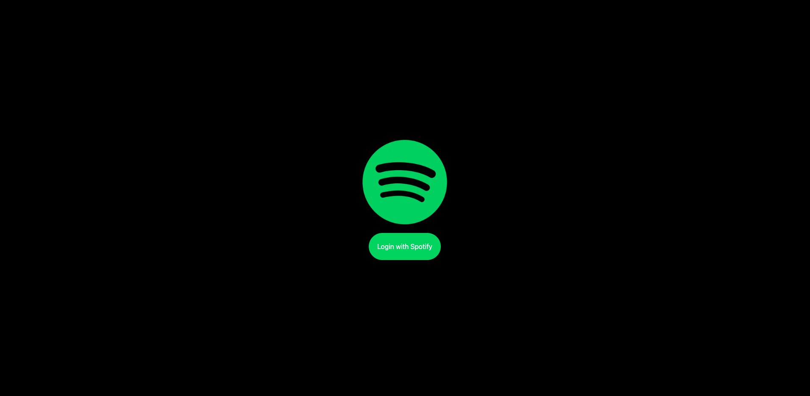
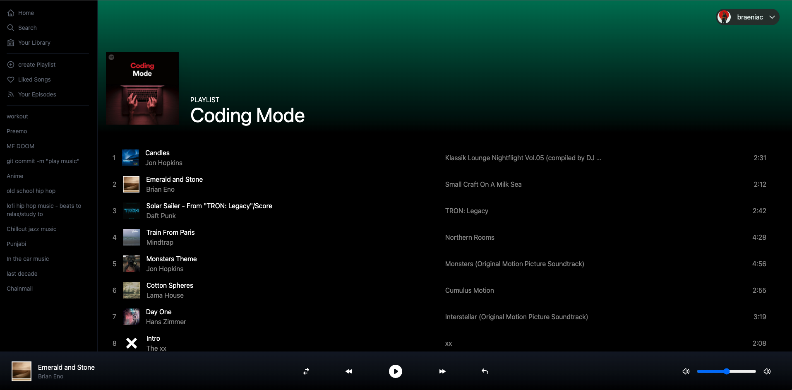

# Spotify Clone

### How to run?

Step 1 : Create a .env.local file. You can find client id/secret from the spotify developers dashboard. https://developer.spotify.com/dashboard/

```
    NEXTAUTH_URL=http://localhost:3000
    NEXT_PUBLIC_CLIENT_SECRET=
    NEXT_PUBLIC_CLIENT_ID=
    JWT_SECRET=

```

Step 2 : Once your in the project directly run:

```
    npm run dev
```

Step 3 : Use your spotify username and password.



Step 4 : Enjoy!!

